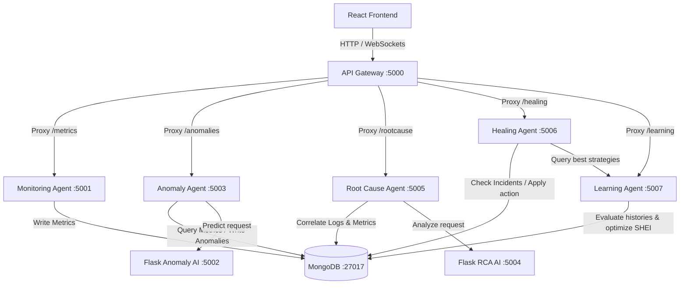
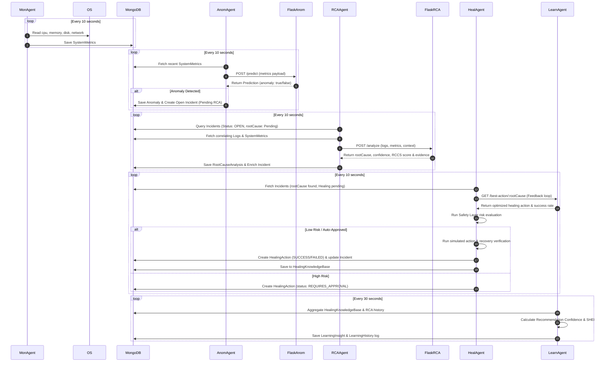
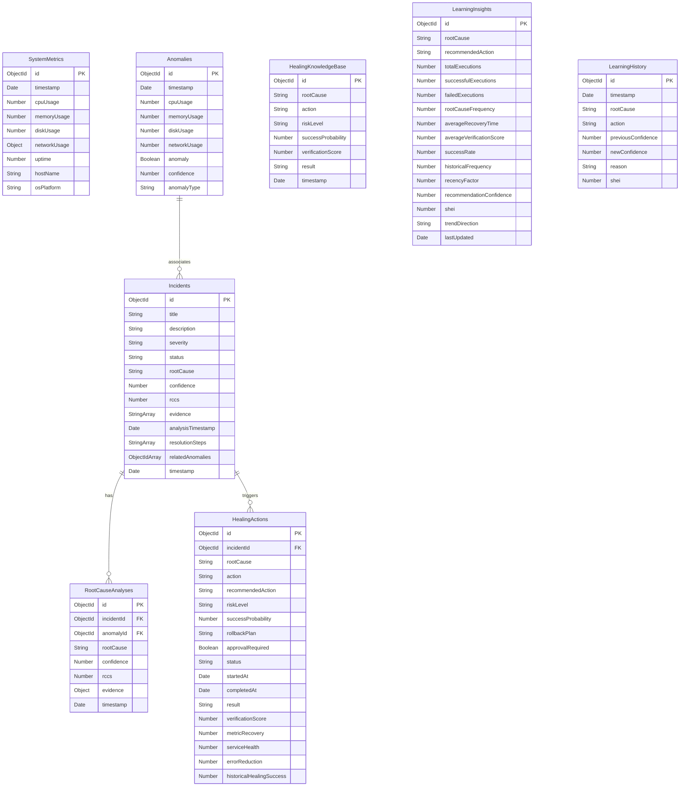

# Cognitive Self-Healing Ecosystem - Final Project Report

The **Cognitive Self-Healing Ecosystem** is an advanced agentic AIOps environment designed to automatically detect, diagnose, remediate, and learn from system anomalies in real time. By leveraging closed-loop telemetry analytics and transformer-based semantic NLP models, the system minimizes human operational overhead.

---

## 1. System Architecture

The ecosystem consists of five node-based microservices, two Python Flask-based AI engines, a centralized API Gateway, and a React-based Dashboard.

---

## 2. Sequence Workflow Diagram

This sequence diagram illustrates the lifecycle of a detected system anomaly:

---

## 3. Database Entity-Relationship (ER) Diagram

---

## 4. Key Features & Telemetry Capabilities

1. **Self-Monitoring Agent**: Real-time Node-level metrics collector extracting platform OS variables directly using standard OS calls.
2. **Machine Learning Anomaly Detection**: Isolation Forest model trained dynamically to flag out-of-bounds resources.
3. **Semantic Log RCA (Sentence Transformers)**: Matches real stack traces and app warnings against known failure profiles using k-Nearest Neighbors text vector classification.
4. **Safety-Fenced Automated Healing**: Evaluates action risk configurations. Restarts and cleanups execute automatically on safe zones, while Critical/High actions are staged inside an Approval Queue.
5. **Continuous Optimization Loop**: Derives recommendation probabilities using historical rates to update policy weights.

---

## 5. Completed Verification & API Checklist

### API Endpoints
- **Gateway (`:5000`)**: `/health`
- **Monitoring (`:5001`)**: `GET /metrics`, `GET /metrics/latest`, `GET /metrics/stats`
- **Anomaly Detection (`:5003`)**: `GET /anomalies`, `GET /anomalies/latest`, `POST /predict-anomaly`
- **Flask Anomaly Service (`:5002`)**: `POST /predict`
- **Root Cause Analysis (`:5005`)**: `GET /rootcauses`, `GET /rootcauses/latest`
- **Flask RCA Service (`:5004`)**: `POST /analyze`
- **Healing Agent (`:5006`)**: `GET /healing-actions`, `POST /execute-healing`
- **Learning Agent (`:5007`)**: `GET /learning-insights`, `GET /learning-insights/latest`, `GET /best-action/:rootCause`, `POST /retrain-learning`

### Math and Scoring Formulas Verified
1. **Root Cause Confidence Score (RCCS)**:
   $$\text{RCCS} = 0.5 \times \text{NLP Similarity} + 0.3 \times \text{Metric Score} + 0.2 \times \text{Historical Accuracy}$$
2. **Verification Score**:
   $$\text{VerificationScore} = 0.4 \times \text{MetricRecovery} + 0.3 \times \text{ServiceHealth} + 0.2 \times \text{ErrorReduction} + 0.1 \times \text{HistoricalHealingSuccess}$$
3. **Recommendation Confidence**:
   $$\text{Confidence} = 0.4 \times \text{SuccessRate} + 0.3 \times \text{AvgVerificationScore} + 0.2 \times \text{HistoricalFrequency} + 0.1 \times \text{RecencyFactor}$$
4. **Self-Healing Effectiveness Index (SHEI)**:
   $$\text{SHEI} = 0.35 \times \text{SuccessRate} + 0.25 \times \text{AvgVerificationScore} + 0.20 \times \text{RootCauseAccuracy} + 0.20 \times \text{RecoveryEfficiency}$$

---

## 6. Future Enhancements
- **Dynamic Training Pipeline**: Implement auto-retraining triggers for the Isolation Forest anomaly detector when Metric collection grows by $10,000$ points.
- **Multi-Agent Consensus**: Introduce consensus-voting protocols across multiple monitoring endpoints to eliminate single-point false positives.
- **Rollback Automation**: Automatically execute rollback plans if `verificationScore` drops below $0.4$ within 10 seconds of healing completion.
